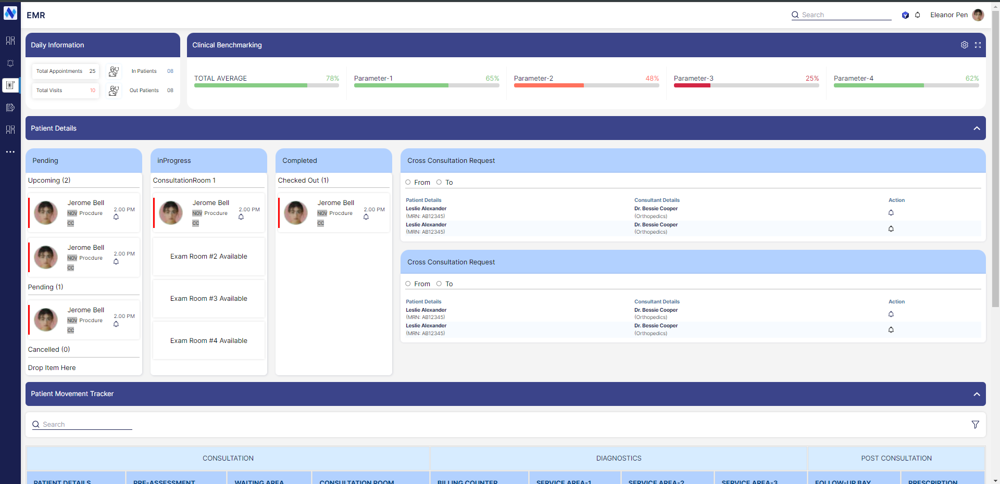

## EMR Dashboard FE Task

- Tech used
- Next.js, React, Typescript, Tailwind + styled-components

### Requirements

To run a Next.js environment, After the dependencies are installed using `npm i` , start the development server by executing the following command:
`npm run dev`

### UI Screenshot

### Deployed Development Version:

https://emr-task.vercel.app/
